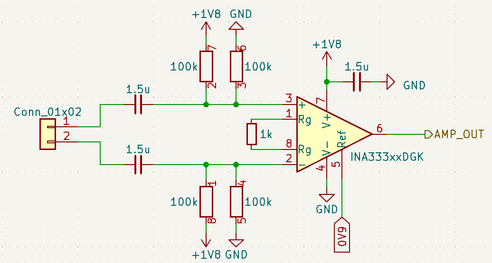

# a low-power, low-cost instrumentation amplifier design for measuring biopotentials and neural signals

I've recently found myself in a scenario where we needed to measure extracellular neural and muscle potentials. Oftentimes, the amplifiers are integrated into an ASIC (for example [Intan](https://intantech.com/) chips, [Neuropixels](https://www.neuropixels.org/), [Cirtec](https://cirtecmed.com/csi080-4-channel-neural-sensing-ic/) chips, or others). However, sometimes it's useful to be able to build a discrete-component amplifier for prototyping purposes. Here's such a design.

## Requirements

1. The design should measure the potential difference between two electrodes, enabling recording neural and muscle potentials.
2. The design should reject a DC offset between the two electrodes, which can occur due to differences in the electrode material/environment
3. The design should reject large common-mode DC offsets (e.g. if the electrodes are both at +10V relative to circuit ground, the circuit should still correctly report on the difference between their voltages.
4. Because most ADCs are single-sided, this circuit should be easily biased so that it's DC output is above zero (without requiring a negative voltage rail).
5. The design should have a gain of ~100 V/V (40 dB) in the passband. This means a +/-5 mV swing on the inputs (a large EMG signal) will map to 0-1 V output (typical input range for an ADC).
6. The passband should be roughly 1 Hz to ~5kHz, as this contains the vast majority of muscle and neural signals, both local field potentials and action potentials.
7. The design should take under 100 uW. (Note: this is an application-specific constraint, but if power is no limitation, some of the commercially available chips above may be good solutions).
8. The circuit should produce under 5uV rms noise in the passband.
9. The input impedance in the passband should be as high as possible, because the electrodes themselves may have an impedance from 1k (e.g. EEG or DBS, macroelectrodes) to >100k (microelectrodes, e.g. Utah arrays). If the input impedance is signicantly lower than the electrode impedance, then most of the signal will be lost, as these two impedances form a voltage divider.

## Circuit design

The basic design is passive high-pass filters on both inputs to an instrumentation amplifier, with the amplifier inputs DC-biased to half the rail voltage. Each input is capacitively coupled, which achieves objectives 2 and 3 above. To present a path for input bias current, and to ensure the input voltages stay within the rails of the amplifier, we use a split-resistor design with 100k resistors. This biases the inputs to mid-range, which is necessary because the instrumentation amplifier will not necessarily behave appropriately if inputs go outside its supply voltages. Instrumentation amplifiers are provide a straightforward way to DC bias their outputs, so that if the inputs were shorted together (exactly equal), the amplifier would produce a given DC offset (spec 4).

The instrument amplifier chosen here is a [INA333](https://www.ti.com/product/INA333) instrumentation amplifier. At a gain of 100 (spec 5), it has a bandwidth of 3.5 kHz, barely missing spec 6. This amplifier draws 50uA quiescent current (meeting spec 7 at 1.8V). Noise on the INA333 is spec'd at 50 nV/sqrt(Hz), which is about 3 uV for a 3500 Hz bandwidth, and 3.5 uV at 5 kHz, consistent with spec 8. However, total noise will also incorporate the thermal noise of the split resistor, which is ~2.9uV RMS at room temperature at 5kHz.

One shortcoming of this design is that the split resistor design presents inherent tradeoffs: larger resistor values dissipate less energy and create a larger input impedance, but increase thermal noise.

