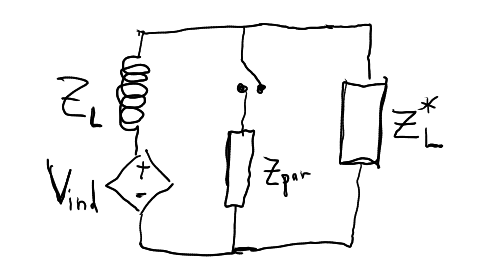
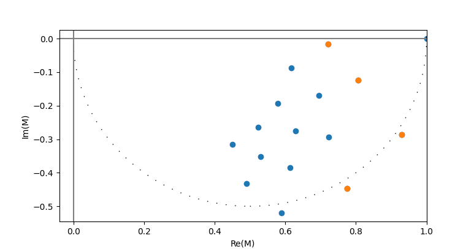

# Engineering inductive backscatter for amplitude & phase shift keying (APSK)

Backscatter is a name for the magnetic field induced by current flow in the circuit, which is itself induced by changes in an external magnetic field ([Faraday's law](https://en.wikipedia.org/wiki/Faraday%27s_law_of_induction)).

This basic process looks like this:
1. A changing magnetic field generates a voltage inside an inductor.
2. Voltage causes some current to flow (this depends both on the inductor and the circuit itself).
3. Current flow through the inductor creates a magnetic field. This is the backscattered magnetic field.

An important result of this process is that by changing the circuit properties dynamically, we can change the magnitude and phase of the backscattered magnetic field in order to send a signal. This is backscatter-based communication.

## Backscatter signal limitations
Due to Lenz's law, the voltage induced in the inductor will generate a current that opposes the change of magnetic field. Therefore, its not possible to passively backscatter a signal that is in phase with the driving signal, only one that is out of phase with it. More precisely, one can backscatter up to +-90 degrees from antiphase with the driving magnetic field.

## Backscattering while power harvesting (impedance-matched scenario)
Oftentimes, the inductor's current is being used to power a circuit (that often generates the data to backscatter). In that case, one often employs impedance matching to optimize power delivery to said circuit. Impedance matching can be thought of as changing the circuit's real part by adding a reactive load in parallel, and then adding a series reactance that is equal and opposite the remaining reactance to cancel it out, yielding a load that looks entirely real and of the same magnitude as the source (see the [wikipedia article on maximal power transfer](https://en.wikipedia.org/wiki/Maximum_power_transfer_theorem)).

When a load is impedance matched to the source, the current that flows through the inductor is *in phase* with the driving voltage (90 degrees ahead of the magnetic field, since the electric field is proportional to the change in magnetic field, $\epsilon = -\frac{d\Phi}{dt}$, where $\epsilon$ is the electric field along a loop and $\Phi$ is the magnetic flux through that loop [Faraday's law](https://en.wikipedia.org/wiki/Faraday%27s_law_of_induction))

## Modulating backscatter with a parallel load
By adding a parallel load $Z_{par}$, we can change the amount of current that flows through the coil and its phase. Consider the following circuit, where we can switch an extra load $Z_{par}$ in and out of the circuit to change the backscattered signal (and perhaps use this to transmit a binary signal).

The impedance seen by the inductive voltage source $V_{ind}$ (at the chosen frequency) is

$$ Z_{total} = \frac{|Z_L|^2 + 2Re(Z_L)Z_{par}}{Z_{par} + {Z_L}^*} $$

And more specifically, the relative change in current, as compared to no added load ($Z_{par}=\infty$) is

$$
M = \frac{ I_{with~Z_{par}} }{ I_{without~Z_{par}}} = \frac{Z_{without~Z_{par}}} {Z_{with~Z_{par}}} = \frac{2Re(Z_L)}{Z_{total}} = \frac{Z_{par} + {Z_L}^*}{Z_{par} + \frac{|Z_L|^2}{2Re(Z_L)}}
$$

$M$ is a complex number, where a real value means the backscattered signal (the current through the inductor) is in phase with the driving voltage, and a purely imaginary value means its 90 degrees out of phase. In general, we can think of $M$ as a point in the complex plane that says how large the in-phase part is (the real part) and how large the out-of-phase part is (the imaginary component).

We might want to try to choose $Z_{par}$ to get a specific backscattered amplitude and phase. Therefore, we solve the above equation for $Z_{par}$ as a function of $M$, yielding

$$ Z_{par} = \frac{ {Z_L}^* - \frac{|Z_L|^2}{2Re(Z_L)}M}{M-1} $$

This sort of suggests that we could choose *any* M we wanted (including, say M=-1, where the current would be 180 degrees OUT of phase with the voltage, or M=10, which would be a 10x signal amplification). However, that turns out to NOT be the case, because if we plug in say M=10, we get a value of $Z$ with a negative real part, and negative resistances aren't possibly (without an additional energy source!).

## How much power do we lose when we switch in a parallel load?
We know the the total current going through inductor drops by a factor of $M$. This current is further divided between two parallel paths: $Z_{par}$, and the load we're trying to power, which (after impedance matching) has impedance ${Z_L}^*$.

This is a [current divider](https://en.wikipedia.org/wiki/Current_divider), and the fraction of the current that goes through the originally impedance-matched load is $\frac{Z_{par}}{Z_{par} + {Z_L}^*}$. Therefore, the relative reduction in power delivered to the circuit's load while backscattering with a parallel load $Z_{par}$ is:

$$
M = \frac{ P_{with~Z_{par}} }{ P_{without~Z_{par}}} = |M|^2 \frac{|Z_{par}|^2}{|Z_{par} + {Z_L}^*|^2}
$$

## Choosing loads that enable parallel combinations as discrete symbols
If we wanted to send $n$ bits of information in each symbol, we'd ideally like $2^n$ symbols in $M$ space that are as far apart as feasible. In the case of passive backscatter, that would be roughly around a circle with diameter 1 centered at (0.5, 0). However, that would require $2^n$ LRC circuits, with a multiplexer allowing any single one to be selected. It would be much simpler if we could use just $n$ LRC circuits, and each binary combination of said circuits would yield a discrete symbol! But can we do that? And if so, how well does it work?

To address this, I wrote a short python script to attempt to find 4 RC load circuits where all 16 binary combinations of those loads would yield well-separated symbols. I asked the solver to maximize the minimum distance between any two symbols ($M$ values). Note that this was for an inductive power source of 75uH with a real resistance of ~13 ohms at 1 MHz (Q of about 36). The plot below shows the solution, where orange points indicate the backscattered symbols for each individual RLC circuit, and blue points indicate all parallel binary combinations of those 4 circuits.

For this configuration, the minimum distance between any pair of symbols is ~0.09, and it requires the following four series RC circuits:
1. R=22.0k, C=None
2. R=0, C=5.7pF
3. R=23.8k, C= 8.7pF
4. R=0, 10.7pF
