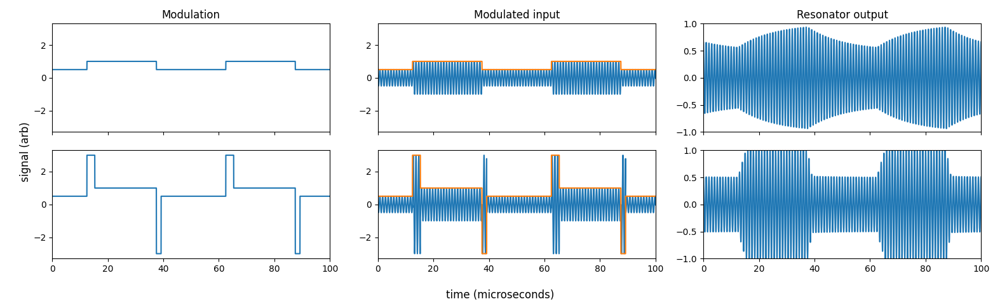

# Exceeding the Q bandwidth limit for communication via high-Q resonant coupled inductors

## Overview

1. In inductive links (e.g. [NFC](https://en.wikipedia.org/wiki/Near-field_communication), [Qi](https://en.wikipedia.org/wiki/Qi_(standard))), we want to optimize both power transfer and communication speed/bandwidth.
2. Power transfer efficiency (PTE) depends on geometry, and increases linearly with the Q of the driver and the receiver. $PTE \approx k^2 Q_{driver} Q_{receiver}$
3. However, the higher the Q of either the driver or receiver, the longer it takes for that system to adapt to/recognize step changes in amplitude. $\tau = \frac{Q}{\pi f_0}$ seconds (or $\frac{Q}{\pi}$ cycles).
4. If this imposes an unacceptable bandwidth limit, there are a few possible options:
    1. reduce the Q (but power transfer will suffer).
    2. change the data encoding from an AM to an FM scheme.
    3. pre-distort the drive signal such that the receiver sees a sudden step in amplitude, not an exponential decay transition.
5. Here I explore a simple scheme for the last option, which can yield significant improvements in bandwidth.

## Approach

In general, if we have an LTI system $H(w)$, we can calculate an input $X(w) = Y(w) / H(w)$ that will yield some desired output $Y(w)$ after passing through the system. For example, we might want $Y(t)$ to be a sine wave at the carrier frequency, amplitude-modulated by a slower square wave. We would calculate $Y(t)$, calculate the Fourier transform $Y(w)$, calculate $X(w) = Y(w) / H(w)$, and then solve for $X(t)$ as the inverse Fourier transform of $X(w)$.

While this 'pre-distortion' scheme is general, it often yields inputs that require unrealistic amplitudes, and requires the storage of a complex pre-distorted input. We can avoid both of those issues if we focus on the case of $H(w)$ being a resonator system, and assume we have a physical maximum drive voltage $V_{max}$. Here's the scheme:

1. To transition from a low to a high amplitude, we briefly drive the resonator at maximum amplitude (at the carrier frequency) before returning to the steady-state "high" drive amplitude.
2. To transition from a high to a low amplitude, we briefly *invert the  drive* and drive at maximum amplitude, before switching back to the non-inverted steady-state "low" drive amplitude.

If $V_{max}$ is significantly larger than the "high" state amplitude $V_H$, this yields a bandwidth improvement for the *driver* of roughly
$$
\frac{V_{max} - V_H}{V_H - V_L}
$$
where, again, $V_{max}$ is the maximum drive amplitude possible, $V_H$ is the steady-state drive amplitude for the logic "high" state, and $V_L$ is the drive amplitude for the logic "low" state. In this scheme, the Q of the driver must be known in advance, and remain stable during operation.

How long is "briefly" in the above description of the approach?
1. To transition from low to high, it is $-\tau \ln \( 1 - \frac{V_H - V_L}{V_{max} - V_H} \)$, where $\tau = \frac{Q}{\pi f_0}$, $Q$ is the system quality factor, and $f_0$ is the system resonant frequency.
2. To transition from high to low, it's $-\tau \ln \( 1 - \frac{V_H - V_L}{V_{max} + V_H} \)$ (just the denominator that changes).

## Example
Here's an example for a system with a Q of 40, a resonant frequency of 1 MHz, with $V_H$ = 1 V, $V_L$ = 0.5 V, and a $V_{max}$ = 3 V. The symbol rate here is 40 kHz, or put differently, a high- or low-amplitude state lasts 25 microseconds. In the top row (in which we simply modulate the input to the resonator with the desired output square wave), the resonator is nearly smoothing (filtering) out the modulation (rightmost plot). However, if we overdrive the resonator each time we switch states, as described above, then we get rapid, precise transitions between levels.

And [here's the script](pre-distortion-high-q.py) that runs that analysis.

## What's omitted here?
1. All of the above analysis concerned a single resonator, not a pair of coupled resonances as in an inductive link. In the regime of very weak coupling, the above scheme basically just ensures the *drive coil* has a step-like amplitude transition. The voltage observed by the receiver still has to ring down on its own, so we're still stuck with bandwidth limits of the receiver Q.
2. During this modulation, is power transfer efficiency still high? Or have we inadvertently sacrified power transfer efficiency when we have to overdrive the drive coil?
